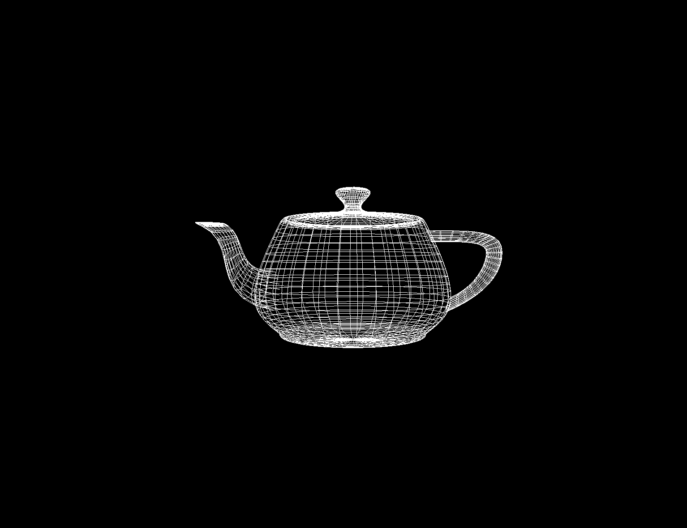

# Simple OpenGL Renderer

This is a *very* simple OpenGL renderer. 

Features:
- Load OBJ files to display a spinning model
- Change rendering mode to various OpenGL modes
- Change camera distance to account for larger models
- A few OBJ files to load and play around with

### Usage:

`./main (obj_file) (GL_POINTS | GL_TRIANGLES | GL_LINES) (distance) [fps]`

Parameters explained:
- `./main` - The executable
- `(obj_file)` - The .obj file to render
- `(GL_POINTS | GL_TRIANGLES | GL_LINES)` - The [mode](https://en.wikibooks.org/wiki/OpenGL_Programming/GLStart/Tut3) to render the model with
- `(distance)` - The distance from the model itself
- `[fps]` - Optional argument to print FPS, time per frame, and total ticks

#### Example:
`./main obj_files/teapot.obj GL_LINES 10`

#### TODO:
- [ ] Fix OBJ loader to support quad faces  (f 1 2 3 4 instead of just f 1 2 3)
- [ ] Cleanup code
- [ ] Add Camera system with simple controls
